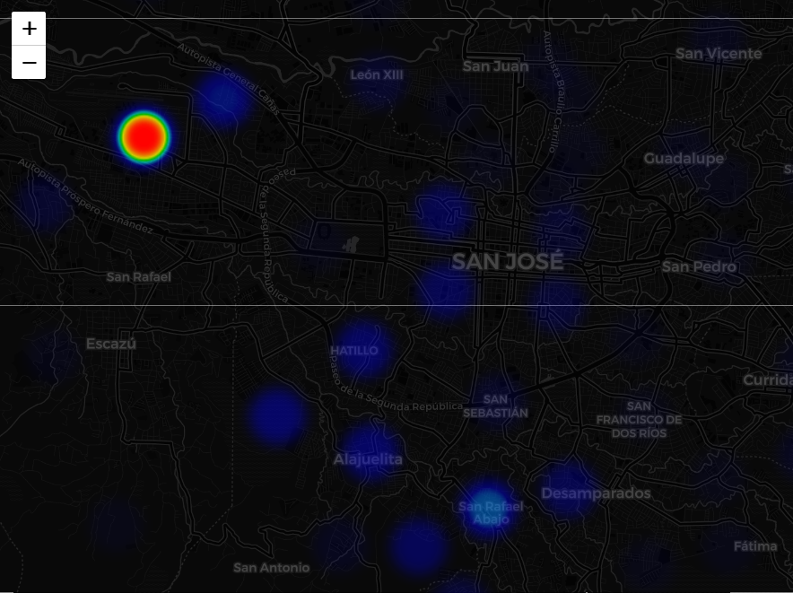
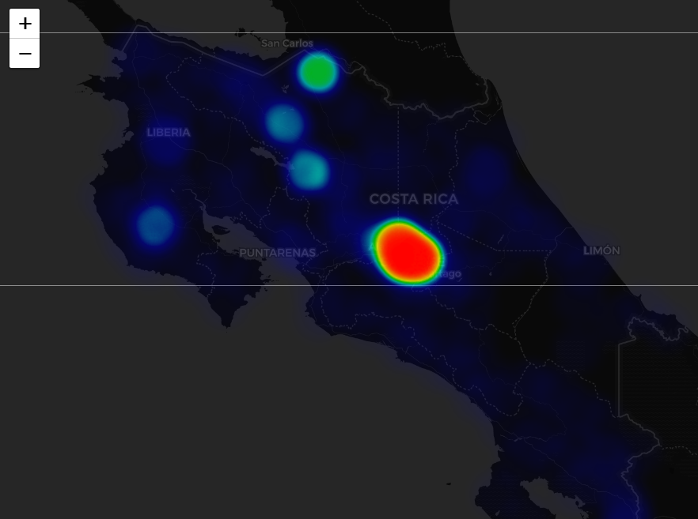
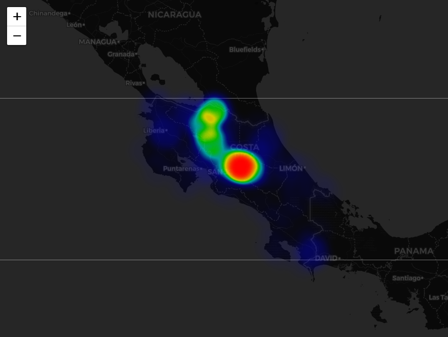

```{r setup, include=FALSE}
knitr::opts_chunk$set(echo = TRUE)
```

## Descripción general
En este tarea programada, elaborará un tablero de control con el paquete [flexdasboard](https://cran.r-project.org/web/packages/flexdashboard/) del lenguaje de programación [R](https://www.r-project.org/), para visualizar datos de la epidemia de [COVID-19](https://en.wikipedia.org/wiki/Coronavirus_disease_2019) en Costa Rica. El resultado final será un documento en la sintaxis [R Markdown](https://rmarkdown.rstudio.com/), publicado en [GitHub Pages](https://pages.github.com/). Se utilizarán también otros paquetes de R para manejo de datos geoespaciales y gráficos como [sf](https://cran.r-project.org/web/packages/sf/), [leaflet](https://cran.r-project.org/web/packages/leaflet/) y [plotly](https://cran.r-project.org/web/packages/plotly/), entre otros.

El tablero presentará los datos publicados por el Ministerio de Salud de Costa Rica sobre la [situación nacional del COVID-19](http://geovision.uned.ac.cr/oges/).

En la dirección [https://geoprocesamiento-2020i.github.io/tablero-control-covid19-cr/](https://geoprocesamiento-2020i.github.io/tablero-control-covid19-cr/) (con código fuente en [https://github.com/geoprocesamiento-2020i/tablero-control-covid19-cr](https://github.com/geoprocesamiento-2020i/tablero-control-covid19-cr)) hay un tablero que puede utilizar como punto de partida para la tarea y que puede bifurcar y clonar. Este tablero utiliza los datos del Ministerio de Salud descargados en [https://github.com/geoprocesamiento-2020i/datos/tree/master/covid19/ms](https://github.com/geoprocesamiento-2020i/datos/tree/master/covid19/ms).

## Fecha de entrega y entregables
La fecha límite de entrega de este laboratorio es el **jueves 16 de julio de 2020**. **NO SE ACEPTARÁN TAREAS ENTREGADAS DESPUÉS DE ESA FECHA**. Debe enviarle al profesor por correo electrónico la dirección del sitio en GitHub Pages resultante.

La tarea puede realizarse en grupos de un máximo de tres estudiantes. Por favor copie el mensaje de correo a las direcciones de todos los integrantes del grupo.

## Trabajo previo
Se recomienda leer el material preparado por el profesor para las lecciones y consultar la documentación y tutoriales de los paquetes de R que se utilizarán.

## Trabajo a realizar
### Obligatorio
Con los datos de casos de COVID-19 publicados por el Ministerio de Salud y la funcionalidad brindada por el paquete ```flexdashboard```, y otros, elabore un tablero de control con los siguientes componentes (el valor porcentual de cada uno en la nota final de la tarea se muestra entre paréntesis):

Cinco páginas (20% cada una):

1. **Resumen**.  
    1.1. (10%) **Indicadores (_valueboxes_)** de total de casos positivos, total de casos activos, total de casos recuperados, total de casos fallecidos, total de hospitalizados, hospitalizados en salón y hospitalizados en UCI. Cada indicador, además de su valor, debe desplegar el cambio con respecto al día anterior (ej. +20, -15) y el porcentaje que representa con respecto al total correspondiente. Además, cada indicador debe tener un color y un ícono adecuado.  
    1.2. (5%) **Gráfico de líneas** que muestre la evolución de los diferentes tipos de casos (positivos, activos, recuperados y fallecidos) a través del tiempo. Los controles y la interfaz del gráfico deben estar en español.  
    1.3. (5%) **Tabla de casos** por cantones que muestre para cada cantón: provincia, nombre del cantón y cantidades de casos positivos, activos, recuperados y fallecidos. La tabla debe contar con funcionalidades de búsqueda, páginación y ordenamiento de las diferentes columnas.  
2. **Casos positivos**.  
    2.1. (5%) **Indicadores (_valueboxes_)** de total de casos positivos, mujeres, hombres, adultos, mayores y menores. Cada indicador, además de su valor, debe desplegar el cambio con respecto al día anterior (ej. +20, -15) y el porcentaje que representa con respecto al total correspondiente. Además, cada indicador debe tener un color y un ícono adecuado.  
    2.2. (10%) **Mapa** de casos positivos por cantón. El mapa debe mostrar la cantidad de casos en cada cantón por medio de una rampa de colores. Debe tener leyenda, un control de capas y una o más capas base.  
    2.3. (5%) **Gráfico de barras** que muestre los 10 cantones con más casos positivos. El gráfico debe estar ordenado por cantidad de casos, y mostrar el cada barra el nombre del cantón correspondiente.  
3. **Casos activos**.  
    3.1. (5%) **Indicadores (_valueboxes_)** de total de casos activos, mujeres, hombres, adultos, mayores y menores. Cada indicador, además de su valor, debe desplegar el cambio con respecto al día anterior (ej. +20, -15) y el porcentaje que representa con respecto al total correspondiente. Además, cada indicador debe tener un color y un ícono adecuado.  
    3.2. (10%) **Mapa** de casos activos por cantón. El mapa debe mostrar la cantidad de casos en cada cantón por medio de una rampa de colores. Debe tener leyenda, un control de capas y una o más capas base.  
    3.3. (5%) **Gráfico de barras** que muestre los 10 cantones con más casos activos. El gráfico debe estar ordenado por cantidad de casos, y mostrar el cada barra el nombre del cantón correspondiente.  
4. **Casos recuperados**.  
    4.1. (5%) **Indicadores (_valueboxes_)** de total de casos recuperados, mujeres, hombres, adultos, mayores y menores. Cada indicador, además de su valor, debe desplegar el cambio con respecto al día anterior (ej. +20, -15) y el porcentaje que representa con respecto al total correspondiente. Además, cada indicador debe tener un color y un ícono adecuado.  
    4.2. (10%) **Mapa** de casos recuperados por cantón. El mapa debe mostrar la cantidad de casos en cada cantón por medio de una rampa de colores. Debe tener leyenda, un control de capas y una o más capas base.  
    4.3. (5%) **Gráfico de barras** que muestre los 10 cantones con más casos recuperados. El gráfico debe estar ordenado por cantidad de casos, y mostrar el cada barra el nombre del cantón correspondiente.  
5. **Casos fallecidos**.  
    5.1. (5%) **Indicadores (_valueboxes_)** de total de casos fallecidos, mujeres, hombres, adultos, mayores y menores. Cada indicador, además de su valor, debe desplegar el cambio con respecto al día anterior (ej. +20, -15) y el porcentaje que representa con respecto al total correspondiente. Además, cada indicador debe tener un color y un ícono adecuado.  
    5.2. (10%) **Mapa** de casos fallecidos por cantón. El mapa debe mostrar la cantidad de casos en cada cantón por medio de una rampa de colores. Debe tener leyenda, un control de capas y una o más capas base.  
    5.3. (5%) **Gráfico de barras** que muestre los 10 cantones con más casos fallecidos. El gráfico debe estar ordenado por cantidad de casos, y mostrar el cada barra el nombre del cantón correspondiente. 
    
    
### Opcional
Valor: 20% adicional.

Utilice los datos publicados por el Ministerio de Salud a nivel de distrito para generar un [mapa de calor (_heat map_)](https://en.wikipedia.org/wiki/Heat_map) de los casos activos de COVID-19 en Costa Rica como el que se muestra en las siguientes figuras:


  


  


  


Puede utilizar los datos de distritos procesados en el código fuente que se adjunta a este documento.

El mapa resultante debe tener una o más capas base, la capa del mapa de calor y cualquier otra capa que considere útil. Agregue los controles que considere necesarios.

## Recomendaciones generales
1. Finalice primero las secciones obligatorias y luego, si tiene tiempo, desarrolle la parte opcional.
2. Suba constantemente sus avances a su repositorio en GitHub y compruebe que cada avance funcione como espera. **No espere hasta el final para subir el trabajo**.
3. Procure ser consistente en el uso de los colores y de los estilos en general.
